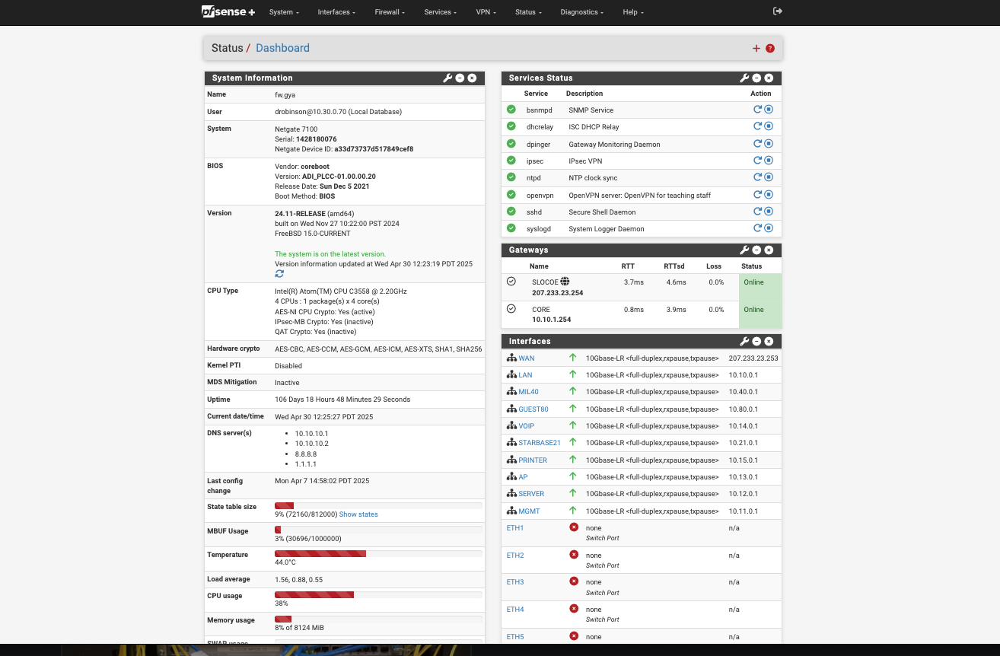
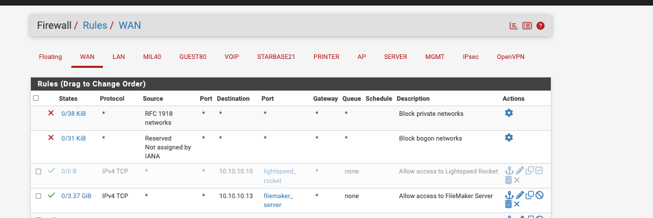
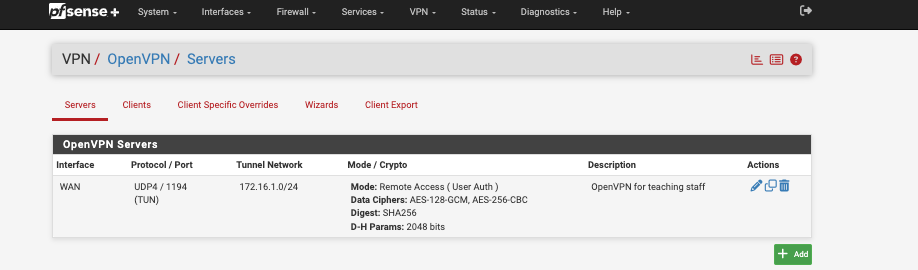

# PFsense+ Firewall Configuration

## Overview
This project showcases my work with **PFsense+**, an open-source firewall and router platform. I configured PFsense+ to secure a network environment, implement traffic filtering, and create firewall rules to block or allow traffic based on specific use cases. This project provides an example of practical skills in network security and traffic monitoring.

## Objectives
- Set up PFsense+ in a virtualized environment.
- Configure **basic firewall rules** to control network traffic.
- Set up **NAT (Network Address Translation)** for internal/external communication.
- Implement **VPN** (Virtual Private Network) for secure remote access.
- Monitor network traffic and logs for suspicious activity.

---

## Lab Setup

### Tools Used
- **PFsense+** (firewall/router OS)
- **VirtualBox** (for virtualization)
- **Ubuntu** (for testing within the network)
- **Wireshark** (for packet capture and network analysis)
- **Windows/Linux clients** (to simulate traffic and network requests)

### Network Architecture
- **Internal Network**: Virtual network for hosts behind the firewall.
- **External Network**: Simulated internet through the virtual network bridge.
- **Firewall**: PFsense+ controlling traffic between the internal network and the internet.

---

## Features Implemented

### ✅ Basic Firewall Rules
- **Blocking/Allowing Traffic**:
  - Blocked all incoming traffic by default and created allow rules for specific services.
  - Allowed only HTTP/HTTPS traffic on certain ports.
- **Example**: Allowed HTTP traffic (port 80) to a web server, but blocked all other inbound connections.

### ✅ Network Address Translation (NAT)
- Configured **Port Forwarding** to allow external users to access certain internal services.
- Set up **Outbound NAT** to allow internal machines to access the internet.

### ✅ VPN Configuration
- Configured **OpenVPN** for secure remote access to the internal network.
- Set up **client-to-site VPN** for remote workers to connect to the network securely.

### ✅ Traffic Monitoring and Logging
- Monitored network traffic using **PFsense+ built-in logs**.
- Configured logging for all blocked traffic for analysis.

---

## Screenshots

| PFsense+ Dashboard | Firewall Rules | VPN Configuration |
|--------------------|----------------|-------------------|
|  |  |  |

---

## Results
- Successfully configured PFsense+ as a firewall and router to protect the internal network.
- Set up VPN to securely connect remote users to the internal network.
- Used monitoring tools to log traffic and troubleshoot network issues.
- Enhanced network security through filtering and traffic control.

---

## Notes
- The project was done in a controlled virtual environment using VirtualBox.
- Screenshots provide proof of configuration steps and setup.
